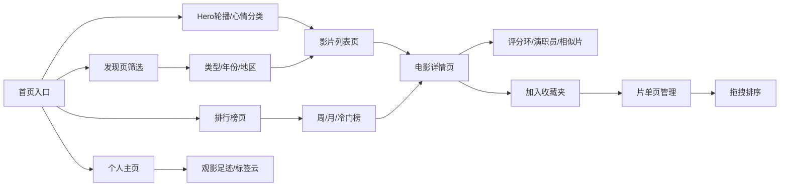

## 1. 产品概述

电影发现站「CineScope」是一个面向周末观影决策困难用户的智能电影推荐平台，通过心情标签、多维度筛选和个性化推荐，帮助用户快速找到心仪影片。

- 核心价值：解决「周末不知道看什么」的选择困难，以心情驱动发现，影院级沉浸体验
- 目标用户：18-40岁都市白领、影迷群体，追求品质观影体验

## 2. 核心功能

### 2.1 功能模块

1. **首页**：Hero大图轮播（当周热映）、心情分类标签入口、精选推荐
2. **电影详情页**：海报展示、环形评分进度条、演职员表、相似影片推荐
3. **片单页**：收藏夹管理、创建/删除片单、拖拽排序影片
4. **发现页**：类型/年份/地区多维筛选、卡片悬浮放大效果
5. **排行榜页**：周榜、月榜、冷门佳作三个维度榜单
6. **个人主页**：观影足迹时间线、口味标签云、观影统计

### 2.2 页面详情

| 页面名称 | 模块名称 | 功能描述 |
|-----------|-------------|---------------------|
| 首页 | Hero轮播 | 自动切换当周热映影片，手动左右切换，指示器导航 |
| 首页 | 心情分类 | 「想哭一场」「烧脑一晚」「笑到抽筋」等8个心情标签入口，点击进入对应筛选页 |
| 首页 | 精选推荐 | 横向滚动影片卡片列表 |
| 详情页 | 英雄区 | 大尺寸海报+渐变遮罩+影片基本信息 |
| 详情页 | 评分环 | SVG环形进度条显示评分（0-10分），带动画绘制 |
| 详情页 | 演职员 | 导演/演员头像卡片，横向滚动 |
| 详情页 | 相似片 | 基于标签推荐的同类影片 |
| 片单页 | 收藏夹列表 | 左侧收藏夹导航，可创建/删除/重命名 |
| 片单页 | 拖拽排序 | 右侧影片卡片支持HTML5拖拽调整顺序 |
| 发现页 | 筛选栏 | 类型（12种）、年份（10个年代）、地区（8个区域）多条件组合 |
| 发现页 | 影片网格 | 响应式网格布局，hover时卡片放大+阴影增强 |
| 排行榜 | 榜单切换 | 周榜/月榜/冷门佳作Tab切换，带切换动画 |
| 排行榜 | 排名卡片 | 前三名特殊样式（金银铜徽章），列表带排名序号 |
| 个人主页 | 观影足迹 | 时间线展示观影历史，按月聚合 |
| 个人主页 | 标签云 | 按观影偏好生成动态标签云，大小反映频次 |

## 3. 核心流程

用户进入首页 → 浏览轮播热映或点击心情标签 → 进入影片列表 → 点击卡片查看详情 → 查看评分/演职员/相似片 → 添加到收藏夹 → 在片单页管理排序 → 发现页多维筛选 → 排行榜找口碑佳片 → 个人页查看观影轨迹

## 4. 用户界面设计

### 4.1 设计风格
- **主色调**：琥珀金 `#D4A24C`（影院灯光感），深炭灰背景 `#121212` - `#1A1A1A` 渐变
- **辅助色**：暗红色 `#8B2635`（幕布红），米白文字 `#F5F0E8`
- **按钮风格**：圆角12px，琥珀金渐变填充，hover有金色光晕
- **字体**：标题用「Playfair Display」衬线体（电影海报感），正文用「Noto Sans SC」无衬线
- **布局风格**：卡片式布局，胶片质感边框（深色条纹+金色角标）
- **图标风格**：线性图标，琥珀金色，细线条

### 4.2 页面设计概览

| 页面名称 | 模块名称 | UI元素 |
|-----------|-------------|-------------|
| 首页 | Hero轮播 | 全屏宽度，渐变遮罩底部文字，3D过渡切换，5秒自动轮播 |
| 首页 | 心情分类 | 胶囊形标签，琥珀金描边，hover填充，图标+文字 |
| 详情页 | 评分环 | 直径120px，金色渐变描边，数字居中，入场绘制动画 |
| 详情页 | 胶片卡片 | 海报两侧黑色齿孔边框，金色边角装饰，阴影层次 |
| 发现页 | 悬浮卡片 | hover时scale(1.05)，阴影blur放大，边框金色高亮 |
| 排行榜 | 排名卡片 | 前三名3D浮雕效果，金/银/铜色徽章，背景渐变 |
| 全局 | 页面切换 | 幕布拉开过渡效果（两侧黑色幕布向两边滑开） |
| 个人页 | 标签云 | 随机浮动动画，hover放大加深色 |

### 4.3 响应式
- 桌面优先（1280px+），移动端断点768px
- 轮播自适应高度，卡片网格断点调整列数
- 移动端底部Tab导航，桌面端顶部导航栏
