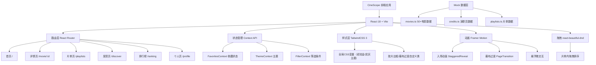
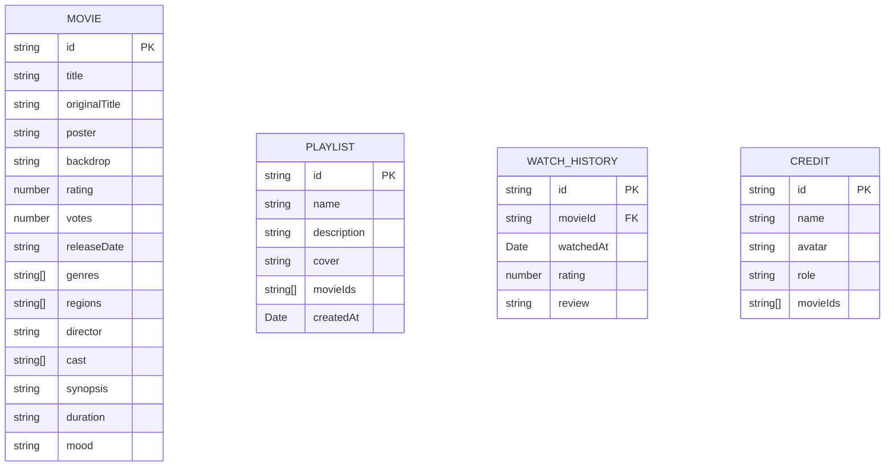

## 1. 架构设计



## 2. 技术说明

- **前端框架**：React@18 + TypeScript
- **构建工具**：Vite@5
- **样式方案**：TailwindCSS@3 + PostCSS
- **路由方案**：react-router-dom@6
- **动画库**：framer-motion@11
- **拖拽库**：@dnd-kit/core + @dnd-kit/sortable
- **状态管理**：React Context API + useReducer
- **数据方案**：本地Mock数据 + localStorage持久化
- **字体方案**：Google Fonts（Playfair Display + Noto Sans SC）

## 3. 路由定义

| 路由 | 页面组件 | 用途 |
|-------|---------|---------|
| `/` | HomePage | 首页：轮播+心情分类+精选推荐 |
| `/movie/:id` | MovieDetailPage | 电影详情页：评分环+演职员+相似片 |
| `/playlists` | PlaylistsPage | 片单页：收藏夹管理+拖拽排序 |
| `/discover` | DiscoverPage | 发现页：类型/年份/地区筛选 |
| `/discover/mood/:moodId` | DiscoverPage | 心情分类快捷入口 |
| `/ranking` | RankingPage | 排行榜：周榜/月榜/冷门佳作 |
| `/profile` | ProfilePage | 个人主页：观影足迹+标签云 |

## 4. 数据模型

### 4.1 数据模型定义



### 4.2 核心TypeScript类型

```typescript
interface Movie {
  id: string;
  title: string;
  originalTitle: string;
  poster: string;
  backdrop: string;
  rating: number; // 0-10
  votes: number;
  releaseDate: string;
  year: number;
  genres: string[];
  regions: string[];
  director: string;
  cast: CastMember[];
  synopsis: string;
  duration: number; // minutes
  mood: MoodType;
  weeklyRank?: number;
  monthlyRank?: number;
  hiddenGem?: boolean;
}

interface CastMember {
  id: string;
  name: string;
  avatar: string;
  role: 'director' | 'actor';
  character?: string;
}

interface Playlist {
  id: string;
  name: string;
  description: string;
  cover: string;
  movieIds: string[];
  createdAt: string;
}

interface WatchRecord {
  id: string;
  movieId: string;
  watchedAt: string;
  userRating?: number;
}

type MoodType = 
  | 'cry' | 'brainy' | 'laugh' | 'romance'
  | 'thriller' | 'warm' | 'inspire' | 'scifi';

type RankingType = 'weekly' | 'monthly' | 'hidden';
```

## 5. 目录结构

```
src/
├── components/          # 通用组件
│   ├── layout/         # 布局组件 (Navbar, Footer, PageTransition)
│   ├── movie/          # 电影相关 (MovieCard, FilmBorder, RatingRing)
│   ├── common/         # 通用组件 (MoodTag, CurtainTransition, EmptyState)
│   └── forms/          # 表单组件
├── pages/              # 页面组件
│   ├── HomePage.tsx
│   ├── MovieDetailPage.tsx
│   ├── PlaylistsPage.tsx
│   ├── DiscoverPage.tsx
│   ├── RankingPage.tsx
│   └── ProfilePage.tsx
├── context/            # Context状态管理
│   ├── FavoritesContext.tsx
│   └── FilterContext.tsx
├── data/               # Mock数据
│   ├── movies.ts
│   ├── cast.ts
│   └── moods.ts
├── hooks/              # 自定义Hooks
│   ├── useLocalStorage.ts
│   └── useViewport.ts
├── types/              # 类型定义
│   └── index.ts
├── utils/              # 工具函数
│   ├── format.ts
│   └── mock.ts
├── styles/             # 全局样式
│   └── globals.css
├── App.tsx
├── main.tsx
└── vite-env.d.ts
```
